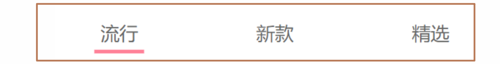
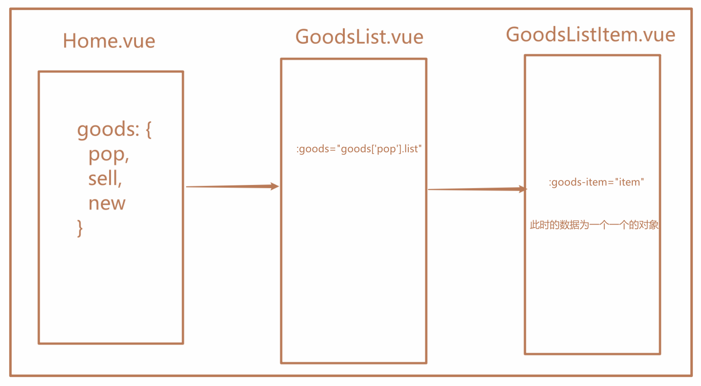
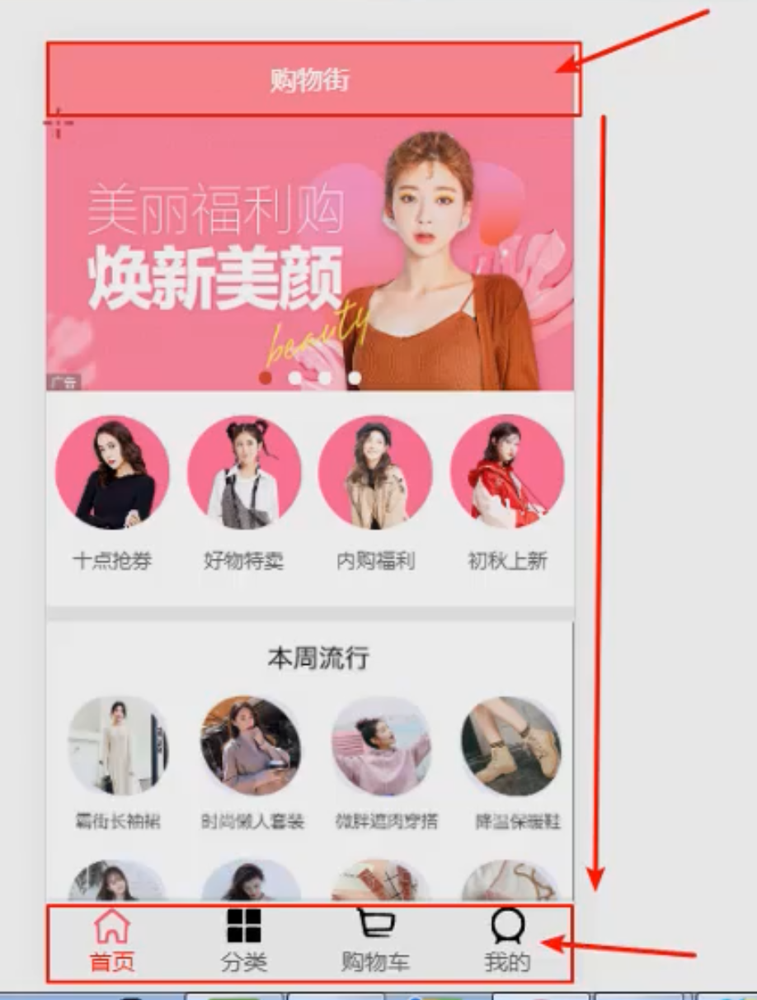

# 环境搭建

```js
node -v
v16.14.0

vue -V
3.0.4
注意：vue -V查看的是vue-cli脚手架的版本。真正的vue的版本必须项目的package.json文件中进行查阅。

创建工程
vue create super-mall

路由版本
npm list vue-router
super-mall@0.1.0 D:\_B.study\_B2.front-end\_01.mall\project\super-mall
└── vue-router@3.0.2 -> .\node_modules\_vue-router@3.0.2@vue-router

安装 axios
cnpm install  axios@0.18.0 --save
```

vue-cli创建项目特别慢解决方法

```vue
虽然设置过淘宝镜像 npm install -g cnpm --registry=https://registry.npm.taobao.org

但是通过vue init webpack projectName新建项目是和淘宝镜像没关系的，因为vue-cli 用的是 npm 源，所以只要设置 npm 源就行了，可以提升创建速度：

npm config set registry https://registry.npm.taobao.org

————————————————
原文链接：https://blog.csdn.net/weixin_42454721/article/details/88138378
```

使用 `github`

```vue
问题描述：本地创建通过 vue create super-mall 新建了一个工程，现在到GitHub上也新建了一个 super-mall仓库，如何将二者关联起来？

$ git remote add origin git@github.com:yT094/super-mall.git
$ git push origin master

此时报错：
 ! [rejected]        master -> master (fetch first)
error: failed to push some refs to 'github.com:yT094/super-mall.git'
hint: Updates were rejected because the remote contains work that you do
hint: not have locally. This is usually caused by another repository pushing
hint: to the same ref. You may want to first integrate the remote changes
hint: (e.g., 'git pull ...') before pushing again.
hint: See the 'Note about fast-forwards' in 'git push --help' for details.

使用 git pull
$ git pull
warning: no common commits
remote: Enumerating objects: 3, done.
remote: Counting objects: 100% (3/3), done.
remote: Compressing objects: 100% (2/2), done.
remote: Total 3 (delta 0), reused 0 (delta 0), pack-reused 0
Unpacking objects: 100% (3/3), 1.17 KiB | 300.00 KiB/s, done.
From github.com:yT094/super-mall
 * [new branch]      master     -> origin/master
There is no tracking information for the current branch.
Please specify which branch you want to merge with.
See git-pull(1) for details.

    git pull <remote> <branch>

If you wish to set tracking information for this branch you can do so with:

    git branch --set-upstream-to=origin/<branch> master

执行如下指令：
$ git branch --set-upstream-to=origin/master master        

继续报错        
The “fatal: refusing to merge unrelated histories” Git error 
（原因：初始化时远程仓库加了一个文件）
$ git pull origin master --allow-unrelated-histories
参考链接：https://www.educative.io/edpresso/the-fatal-refusing-to-merge-unrelated-histories-git-error
        
$ git push origin master 
大功告成
        
总结：遇到问题，多看报错信息和提示，不能解决，再去Google上找解决办法。
```

划分目录结构

```js
src                         // 源码目录
|-- assets                  // 静态资源
|   |-- font                // iconfont
|   |-- img                 // 图片资源
|   |-- css                 // 样式文件
|   |   |-- base.css        // 基本样式文件
|   |   |-- normal.css      // 样式文件（适合大多数项目）
|-- common                  // 公共的js文件
|   |-- const.js            // 常量文件
|   |-- mixin.js            // 混入文件
|-- components              // 公共组件
|   |-- common              // 可以在其他项目使用的组件
|   |-- content             // 只能在本项目使用的公共组件
|-- network                 // 网络
|-- router                  // 路由
|-- store                   // vuex
|-- views                   // 视图目录
|   |-- Home                // 主页
|   |-- Category            // 分类
|-- App.vue                 // App
|-- main.js                 // main
```

在css中定义变量

```css
// :root：获取根元素html
// --color-text: #666; 这是 css中定义变量的方式

:root {
  --color-text: #666;
  --color-high-text: #ff5777;
  --color-tint: #ff8198;
  --color-background: #fff;
  --font-size: 14px;
  --line-height: 1.5;
}
```

在vue-cli 3 中为文件夹设置别名

```js
新建一个vue.configure.js文件，与src同级

module.exports = {
  configureWebpack: {
    resolve: {
      // 配置路径别名
      alias: {
        // @ 为 src 的别名
        assets: "@/assets",
        common: "@/common",
        components: "@/components",
        network: "@/network",
        views: "@/views" 
      }
    }
  }
}
```

 为工程项目添加配置

```js
新建一个 .editorconfig 文件，与src同级
root = true

[*]
charset = utf-8
indent_style = space
indent_size = 2
end_of_line = lf
insert_final_newline = true
trim_trailing_whitespace = true
```

## bug修复

### Error: Cannot find module 'semver'

```js
PS D:\_B.study\_B2.front-end\_01.mall\project\super-mall> npm run serve

> super-mall@0.1.0 serve
> vue-cli-service serve

node:internal/modules/cjs/loader:936
  throw err;
  ^

Error: Cannot find module 'semver'
Require stack:
- D:\_B.study\_B2.front-end\_01.mall\project\super-mall\node_modules\@vue\cli-service\bin\vue-cli-service.js
    at Function.Module._resolveFilename (node:internal/modules/cjs/loader:933:15)
    at Function.Module._load (node:internal/modules/cjs/loader:778:27)
    at Module.require (node:internal/modules/cjs/loader:1005:19)
    at require (node:internal/modules/cjs/helpers:102:18)
    at Object.<anonymous> (D:\_B.study\_B2.front-end\_01.mall\project\super-mall\node_modules\@vue\cli-service\bin\vue-cli-service.js:3:16)
    at Module._compile (node:internal/modules/cjs/loader:1103:14)
    at Object.Module._extensions..js (node:internal/modules/cjs/loader:1155:10)
    at Module.load (node:internal/modules/cjs/loader:981:32)
    at Function.Module._load (node:internal/modules/cjs/loader:822:12)
    at Function.executeUserEntryPoint [as runMain] (node:internal/modules/run_main:77:12) {
  code: 'MODULE_NOT_FOUND',
  requireStack: [
    'D:\\_B.study\\_B2.front-end\\_01.mall\\project\\super-mall\\node_modules\\@vue\\cli-service\\bin\\vue-cli-service.js'     
  ]
}

修复bug
I followed These steps and it solved my issue

1.uninstall Node.js
2.Remove the content of the following folders
    C:\Users<user-name>\AppData\Roaming\npm-cache
    C:\Users<user-name>\AppData\Roaming\npm
    C:\Program Files\nodejs
    工程中的 node_modules 包
3.Then again install Node https://nodejs.org/en/
```

### 无法将“npm”项识别为 cmdlet

```
npm : 无法将“npm”项识别为 cmdlet、函数、脚本文件或可运行程序的名称。请检查名称的拼写，如果包括 路径，请确保路径正确，然后再试一次。 

方法一：以管理员身份运行
右击vscode，选择一管理员身份运行，即可解决问题。

————————————————
参考链接：https://blog.51cto.com/u_15127543/4448732
```


# 封装TabBar


## 实现思路

### 1.TabBar中显示的内容由外界决定

- 定义插槽
- flex布局平分TabBar

### 2.自定义TabBarItem，可以传入 图片和文字

- 定义TabBarItem，并且定义两个插槽：图片、文字。
- 给两个插槽外层包装div，用于设置样式。
- 填充插槽，实现底部TabBar的效果

### 3.传入 高亮图片

- 定义另外一个插槽，插入active-icon的数据
- 定义一个变量isActive，通过v-show来决定是否显示对应的icon

### 4.TabBarItem绑定路由数据

- 安装路由：npm install vue-router —save
- 完成router/index.js的内容，以及创建对应的组件
- main.js中注册router
- APP中加入<router-view>组件

### 5.点击item跳转到对应路由，并且动态决定isActive

- 监听item的点击，通过this.$router.replace()替换路由路径
- 通过this.$route.path.indexOf(this.link) !== -1来判断是否是active

### 6.动态计算active样式

- 封装新的计算属性：this.isActive ? {'color': 'red'} : {}

## 引用css资源

### 如何引用css样式？

```vue
1.在vue文件中
<style>
  @import "./assets/css/base.css";
</style>

2.在js文件中
require('./assets/css/base.css')
```


1.js文件和`css`(或vue文件中style里面)文件中，如何引用资源？

> js文件中：用 `import`
>
> css文件中：用`@import`

### bug解析

```js
经验：
1.有时候遇到bug，需要重启一下，npm run serve
```

### 安装less

[Vue项目中使用lang=“less“报错](https://blog.csdn.net/qq_43466788/article/details/113926861)

```
正确操作：npm install --save-dev less-loader@7.x less
```

关于插槽slot的使用

```
在slot的外面包装一个div，避免所定义的样式、v-if等不起效果。
```

### 路径别名问题

```js
DOM 元素中： 


js文件中：
import MainTabBar from "components/content/MainTabBar/MainTabBar"
```

# 封装navbar

## id和class的使用

```css
tabbar 使用 id 选择器，整个项目中只有一个。
navbar 使用 class 选择器，整个项目有多个地方使用。
```

## 导航栏布局


```css
<template>
  <div class="nav-bar">
    <div class="left"><slot name="left"></slot></div>
    <div class="center"><slot name="center"></slot></div>
    <div class="right"><slot name="right"></slot></div>
  </div>
</template>

<style lang="less" scoped>
.nav-bar {
  display: flex;
  height: 44px;
  .left,
  .right {
    width: 44px;
    background-color: red;
  }
  .center {
    flex: 1;
    background-color: #fff;
  }
}
```

## 让文字处于盒子的中心位置

```css
height: 44px;
line-height: 44px;
text-align: center;
```

# 封装network


## 1.创建axios

> `network` 文件夹新建 `request.js` 用于 `axios` 的创建

```js
import axios from 'axios'
export function request(config) {
    //1.创建axios实例
    const instance = axios.create({
        baseURL: 'http://1xx.xxx.xxx.xxx:7878/api/m5',
        timeout: 5000
    })
//2.axios拦截器
instance.interceptors.request.use(config => {
    return config //如果不返回出去，后边就拿不到config了
}, err => {
    console.log(err);
});
instance.interceptors.response.use(res => {
    return res.data
}, err => {
    console.log(err);
});

//3.返回结果
return instance(config)
}
```

## 2.封装Home独有的网络处理函数

> `network` 文件夹新建 `home.js` 。
>
> 封装函数：设置请求的 `url`，导出函数用于创建 `Home.vue` 组件需要的数据：

```js
import { request } from './request'

export function getHomeMultiata() {
  return request({
        url: 'home/multidata'
    })
}
```

## 3.使用函数，拿到数据

> `Home.vue` 组件中使用函数，拿到后台传来的数据：

```js
import { getHomeMultidata } from '@/network/home'

export default {
    name:'Home',
    data(){
      return {
        banners:[],
        recommends:[],
      }
    },
    components:{
      NavBar
    },
    created(){
      getHomeMultidata().then(res=>{
        this.banners = res.data.banner.list;
        this.recommends = res.data.recommend.list;
      })
    }
}
```

### 一些疑问

```js
问题：为什么导入时，一个有大括号，一个没有大括号？

import NavBar from "components/common/navbar/NavBar"
import { getHomeMultidata } from "network/home"


原因：NavBar 是 default 导出，getHomeMultidata 则不是。
```

```js
问题：在 Home.vue 中，为什么要使用 result 去接收数据？ 
data() {
    return {
      result: null
    }
  },
  created() {
    getHomeMultidata().then( res => {
      console.log(res);
      this.result = res;
    })
  }

原因：箭头函数执行完后，会回收内存。此时，在 data 中定义 result 去接收数据。
（本质：res被释放之后，从服务器获取的数据变成了一个孤零零的对象，故系统将回收整个对象。如果在res被释放之前，添加result对这个对象的引用，系统将不会进行回收）

问题：为什么定义了 result 就可以接收呢？
原因：this指向上级作用域，即指向 created 中的 this（即组件对象，一直存在）

问题：内存回收机制？
答案：如下所示
```


```js
问题：在 Home.vue 中，可以在created 中打印 this.result 吗？ 
data() {
    return {
      result: null
    }
  },
  created() {
    getHomeMultidata().then( res => {
      console.log(res);
      this.result = res;
    })
    console.log(this.result); // 可行吗？
  }

答案：不可以，因为 getHomeMultidata() 是一个异步操作。
应该利用插件 Vue Devtools 进行查看。
```


## 4.具体封装过程

### 1.网络请求模块的选择

#### 方案一：传统的Ajax

```
传统的Ajax是基于XMLHttpRequest(XHR)，缺点：

- 配置和调用方式等非常混乱
- 编码起来看起来就非常蛋疼
- 故真实开发中很少直接使用，而是使用 jQuery-Ajax
```


#### 方案二：jQuery-Ajax

```js
优点：相对于传统的Ajax非常好用

缺点：在Vue的整个开发中都是不需要jQuery了，如果为了一个网络请求，特意引入一个jQuery，是不合理的。
```


#### 方案三：Vue-resource

```js
官方在Vue1.0的时候，推出了Vue-resource

优点：Vue-resource的体积相对于jQuery小很多；另外Vue-resource是官方推出的。

缺点：在Vue2.0退出后，Vue作者表示不再更新Vue-resource。
```


#### 方案四：axios

```js
优点：

作者推荐和功能特点

在浏览器中发送XMLHttpRequests请求

在node.js中发送http请求

支持PromiseAPI

拦截请求和响应

转换请求和响应数据

等等
```

### 2.axios API

#### 创建请求

```js
可以通过向 axios 传递相关配置来创建请求
axios({
    method: 'get',
    url: 'http://123.xx.xx.xx:8000/api/home/data',
    // 专门针对get请求的参数拼接
    params: {
	   type: 'pop',
       page: 1 
    }
}).then(res => {
    console.log(res)
})
```

#### post请求和get请求

```js
// 发送 POST 请求
axios({
  method: 'post',
  url: '/user/12345',
  data: {
    firstName: 'Fred',
    lastName: 'Flintstone'
  }
});
```

注意：post请求是 data，get请求是 params

```
get请求，URL查询对象
params:{ id: 12 },

post请求，request body
data: { key: 'aa'},
使用时，需一一对应
```


#### 请求方法的别名

为方便起见，为所有支持的请求方法提供了别名

#### 发送并发请求

有时候，我们可能需求同时发送两个请求

使用axios.all, 可以放入多个请求的数组.

axios.all([]) 返回的结果是一个数组，使用 axios.spread 可将数组 [res1,res2] 展开为 res1, res2

```js
function getCategoryData() {
  return axios.get('http://123.xx.xx.xx:8000/api/hy66/category');
}

function getSellData() {
  return axios.get('http://123.xx.xx.xx:8000/api/hy66/home/data', 
                   { params: {type: 'sell', page: 1}});
}

axios.all([getCategoryData(), getSellData()])
  .then(axios.spread(function (category, sell) {
    // 两个请求现在都执行完成
    console.log(category)
    console.log(sell)
  }));
```

#### axios的全局配置

在开发中可能很多参数都是固定的.

这个时候我们可以进行一些抽取, 也可以利用axiox的全局配置

```js
axios.defaults.baseURL = 'http://123.207.32.32:8000'
axios.defaults.timeout = 5000

axios({
    url: '/home/multidata',
    // 专门针对get请求的参数拼接
    params: {
	   type: 'pop',
       page: 1 
    }
}).then(res => {
    console.log(res)
})
```

#### axios的实例

```js
当我们从axios模块中导入对象时，使用的实例是默认的实例。

当给该实例设置一些默认配置时,，这些配置就被固定下来了。

但是后续开发中，某些配置可能会不太一样。

比如某些请求需要使用特定的baseURL或者timeout或者content-Type等。

这个时候，我们就可以创建新的实例， 并且传入属于该实例的配置信息。
```

### 3.network的封装

#### 方案一：使用回调函数

使用时，传入一个对象和两个回调函数。

````js
// network/request.js 中封装
export function request(config, success, failure) {
  // 1.创建axios的实例
  const instance = axios.create({
    baseURL: 'http://123.207.32.32:8000',
    timeout: 5000
  })

  instance(config)
    .then(res => {
      success(res)
  })
    .catch(err => {
      failure(err)
  })
}

// main.js 中使用
import {request} from "./network/request";

request({
  url: '/home/multidata'
}, res => {
  console.log(res);
}, err => {
  console.log(err);
})

回调函数的实质：将函数作为参数传入另一个函数。
````


#### 方案二：升级版回调函数

使用时，传入一个大的对象。

```js
// network/request.js 中封装
export function request(config) {
  // 1.创建axios的实例
  const instance = axios.create({
    baseURL: 'http://123.207.32.32:8000',
    timeout: 5000
  })

  // 发送真正的网络请求
  instance(config.baseConfig)
    .then(res => {
      // console.log(res);
      config.success(res);
    })
    .catch(err => {
      // console.log(err);
      config.failure(err)
    })
}

// main.js 中使用
import {request} from "./network/request";

request({
  baseConfig: {
  },
  success: function (res) {
  },
  failure: function (err) {
  }
})

```

#### 方案三：Promise方案

```js
// network/request.js 中封装
export function request(config) {
  return new Promise((resolve, reject) => {
    // 1.创建axios的实例
    const instance = axios.create({
      baseURL: 'http://123.207.32.32:8000',
      timeout: 5000
    })

    // 发送真正的网络请求（异步操作）
    instance(config)
      .then(res => {
        resolve(res)
      })
      .catch(err => {
        reject(err)
      })
  })
}

// main.js 中使用
import {request} from "./network/request";

request({
  url: '/home/multidata'
}).then(res => {
  console.log(res);
}).catch(err => {
  // console.log(err);
})

```

#### 方案四：axios内部返回的就是一个Promise

```js
// network/request.js 中封装
export function request(config) {
  // 1.创建axios的实例
  const instance = axios.create({
    baseURL: 'http://123.207.32.32:8000',
    timeout: 5000
  })

  // 发送真正的网络请求
  return instance(config)
}

// main.js 中使用
import {request} from "./network/request";

request({
  url: '/home/multidata'
}).then(res => {
  console.log(res);
}).catch(err => {
  // console.log(err);
})

```

### 4.axios拦截器

即把请求的过程拦截下来。

````js
export function request(config) {
  // 1.创建axios的实例
  const instance = axios.create({
    baseURL: 'http://123.207.32.32:8000',
    timeout: 5000
  })

  // 2.axios的拦截器
  // 2.1.请求拦截的作用
  instance.interceptors.request.use(config => {
    // console.log(config);
    // 1.比如config中的一些信息不符合服务器的要求，比如添加header信息
    // 2.比如每次发送网络请求时, 都希望在界面中显示一个请求的图标，比如显示转圈圈的图标
    // 3.某些网络请求(比如登录(token)), 必须携带一些特殊的信息，比如用户没有登陆就操作，先让用户先登录
    return config	 //如果不返回出去，后边就拿不到config了
  }, err => {
    // console.log(err);
  })

  // 2.2.响应拦截
  instance.interceptors.response.use(res => {
    // console.log(res);
    // 我们只需要 data 信息，其他信息过滤掉
    return res.data
  }, err => {
    console.log(err);
  })

  // 3.返回结果
  return instance(config)
}
````

# 封装HomeSwiper

## 父传子

```js
问题：如何将Home里的banners传给HomeSwiper（子组件）？

答案如下：
第一步：在 Home.vue 中绑定变量
<home-swiper :banners="banners"></home-swiper>

第二步：在 HomeSwiper.vue 中定义 props
props: {
    banners: {
      type: Array,
      default() {
        return [];
      },
    },
  },
      
第三步：在 HomeSwiper.vue 中使用传给来的值
<swiper>
   <swiper-item v-for="item in banners" :key="item.id">
     <a :href="item.link">
       
     </a>
   </swiper-item>
</swiper>
```

# 封装TabControl

## slot



```js
问题：这个地方是否使用slot？
答案：不需要。此处仅文字和个数可能不同，无需使用slot

<template>
  <div class="tab-control">
    <div class="tab-control-item" v-for="item in titles" :key="item.id">
      <span>{{ item }}</span>
    </div>
  </div>
</template>
```

## 数据模型

```js
goods: { 流行/新款/精选}
goods: {
  'pop': { page: 5, list: [150] },
  'new': { page: 2, list: [60] },
  'pop': { page: 1, list: [30] }
}

向数组里面塞数据
getHomeGoods(type) {
  const page = this.goods[type].page + 1;
  getHomeGoods(type, page).then((res) => {
    // 拿到 type 对应的数据
    this.goods[type].list.push(...res.data.list)
    // 页码加 1
    this.goods[type].page += 1
  });
},
```

## 展示商品



## CSS样式

### 多余的文字

```css
问题：多余的文字如何用 ... 显示？

当有一行的内容
overflow:hidden; //超出的文本隐藏
text-overflow: ellipsis; //溢出用省略号显示
white-space:nowrap; //溢出不换行

当有两行的内容
overflow: hidden;
text-overflow: ellipsis;
display:-webkit-box; //作为弹性伸缩盒子模型显示。
-webkit-box-orient:vertical; //设置伸缩盒子的子元素排列方式--从上到下垂直排列
-webkit-line-clamp:2; //显示的行
```

### flex布局


```
注意：space-around 两边空隙之和等于中间空隙
```

### 伪元素


```css
收藏图标制作：
<span class="collect">{{ goodsItem.cfav }}</span>
.collect {
  position: relative;
  &:before {
    content: "";
    position: absolute;
    left: -15px;
    top: -1px;
    width: 14px;
    height: 14px;
    background: url("~assets/img/common/collect.svg") 0 0/14px 14px;
  }
}
```

# 封装BScroll组件

## 获取wrapper

```js
不建议使用：
document.querySelector('.wrapper')

理由：
当其他页面也定义了 class="wrapper" 时，此时拿到的 wrapper 是不明确的。

推荐使用：ref
ref如果是绑定在组件中的，那么通过this.$refs.refname获取到的是一个组件对象
ref如果是绑定在普通的元素中，那么通过this.$refs.refname获取到的是一个元素对象
```

## 计算滚动高度




## 监听点击

```js
原生元素可以直接使用 @click
<div @click="itemClick"></div>
<button @click="btnClick"></button>


组件需使用 @click.native
<back-top @click.native="backClick" />
```

##  bug：TypeError

```css
"itemImageLoad": "TypeError: _this.$refs.scroll.refresh is not a function"

(found in <Root>)

报错原因：没有在 Scroll.vue 中定义 refresh 这个方法

解决bug：
refresh() {
  this.scroll && this.scroll.refresh();
},
```

## bug：滚动bug

### bug分析

    Better-Scroll 在决定有多少区域滚动时，根据 scrollerHeight 属性决定
    - scrollerHeight属性是根据放 Better-Scroll 的 content 中的子组件的高度
    - 但是我们的首页中, 刚开始在计算 scrollerHeight属性时, 是没有将图片计算在内的
    - 所以, 计算出来的告诉是错误的(1300+)
    - 后来图片加载进来之后有了新的高度, 但是scrollerHeight属性并没有进行更新.
    - 所以滚动出现了问题

### 解决bug

```css
- 监听每一张图片是否加载完成, 只要有一张图片加载完成了, 执行一次refresh()
- 如何监听图片加载完成了?
- 原生的js监听图片: img.onload = function() {}
- Vue中监听: @load='imageLoad'
- 调用scroll的refresh()
```

### 数据传递

```
如何将 GoodsListItem.vue 中的事件传入到 Home.vue 中？
```


    1. 因为涉及到非父子组件的通信， 所以这里我们选择了事件总线

```
bus ->总线

第一步：在原型链上注册 $bus
Vue.prototype.$bus = new Vue()

第二步：发出事件
this.$bus.$emit('事件名称', 参数) 

第三步：监听事件
this.$bus.$on('事件名称', 回调函数(参数))
```

2.在GIS开发中：

```js
this.$root.$emit('show-area', this.form.coordinate);

this.$root.$on('show-area', this.showarea);

this.$root.$off('show-area', this.showarea);
```

其他方法：

1.vuex 状态管理器

2.`GoodListItem` 传给 `GoodList`，再传给 `Home.vue`


### 方案选择

```
如何在 GoodListItem 中拿到 this.scroll.refresh ?
```

#### 方案一：逐级上报

可以通过 Home.vue 拿，this.$refs.scroll.scroll.refresh 此时，可在 GoodsListItem 中，将事件发送给 GoodsList，然后 GoodsList 将事件发给 Home.vue ，一级一级地往上报


#### 方案二：vuex

```
搞一个 vuex 对象，让 vuex 做一个中间的通信
```


#### 方案三：事件总线


步骤一：发送一个 itemImageLoad 事件


步骤二：Home.vue 中监听事件


步骤三：vue 实例做数据总线


注意：Scroll.vue 的一个方法


## bug：TypeError 

```js
TypeError：cannot read property 'refresh' of undefined

报错原因一：调用该方法时，scroll对象还没有生成。
refresh() {
  this.scroll.refresh();
},
  
解决bug，提高代码的健壮性
refresh() {
  this.scroll && this.scroll.refresh();
},
    
报错原因二：this.$refs 放在了created中
created() {
  // 3.监听item中图片加载完成
  this.$bus.$on("itemImageLoad", () => {
  // better-scroll 重新计算高度
  this.$refs.scroll.refresh();
 });
},

解决bug：将其放在mounted中，此时DOM已经挂载完成
mounted() {
  // 3.监听item中图片加载完成
  this.$bus.$on("itemImageLoad", () => {
  // better-scroll 重新计算高度
  this.$refs.scroll.refresh();
 });
},    
```

## 防抖操作

### 防抖是什么

```
什么是防抖：比如用户搜索iphone，如果不加防抖，每次输入字母会向服务器发送一次请求，服务器压力很大，因此可以采用防抖，设置延迟，减轻服务器压力。
```

```
防抖(debounce)：触发高频事件后 n 秒内函数只会执行一次，如果 n 秒内高频事件再次被触发，则重新计算时间

举例：就好像在百度搜索时，每次输入之后都有联想词弹出，这个控制联想词的方法就不可能是输入框内容一改变就触发的，他一定是当你结束输入一段时间之后才会触发。
```

### 节流是什么

```
节流(thorttle)：高频事件触发，但在 n 秒内只会执行一次，所以节流会稀释函数的执行频率

举例：预定一个函数只有在大于等于执行周期时才执行，周期内调用不执行。就好像你在淘宝抢购某一件限量热卖商品时，你不断点刷新点购买，可是总有一段时间你点上是没有效果，这里就用到了节流，就是怕点的太快导致系统出现bug。
```

### 二者区别

```
区别：防抖是将多次执行变为最后一次执行，节流是将多次执行变成每隔一段时间执行。
```

### 防抖具体实现

```
如果直接执行： this.$bus.$on('itemImageLoad',()=>{ this.$refs.scroll.refresh() })的话，refresh会被执行30次，服务器压力大，可以把refresh函数传入到debounce中，生成一个新的函数，新函数不会被频繁调用，如果下次执行非常快，会将上次的函数清理掉：
```

### 总结

```

> 本质
优化高频率执行代码的一种手段

> 定义
防抖：n秒后再执行该事件，若在n秒内被重复触发，则重新计时
节流：n秒内只运行一次，若在n秒内重复触发，只有一次生效

> 一个比喻
假设把电梯完成一次运送，类比为一次函数的执行和响应。超时设定为15s
电梯第一个人进来后，等待15秒。如果过程中又有人进来，则重新计时，直到15秒后开始运送，这是防抖
电梯第一个人进来后，15秒后准时运送一次，这是节流

防抖在连续的事件，只需触发一次回调的场景有：
搜索框搜索输入。只需用户最后一次输入完，再发送请求
手机号、邮箱验证输入检测
窗口大小resize。只需窗口调整完成后，计算窗口大小。防止重复渲染。

节流在间隔一段时间执行一次回调的场景有：
滚动加载，加载更多或滚到底部监听
搜索框，搜索联想功能
```

> 参考链接：[什么是防抖和节流？有什么区别？如何实现？](https://vue3js.cn/interview/JavaScript/debounce_throttle.html)

### setTimeout的执行

```js
异步打印顺序排在非异步之后：

console.log('aaaa');

setTimeout( () => {
  console.log('bbbb');
})

console.log('cccc');

执行顺序：aaaa -> bbbb -> cccc
说明：这里和事件循环有关，虽然没有给具体的延迟时间，但是会将延迟函数放到事件尾部
```

# tabControl的吸顶效果

## 为什么吸顶效果不再存在？

```css
.tab-control {
  position: sticky;
  top: 44px;
  z-index: 9;
}
原因：使用了better-scroll组件，而非原生滚动。
```

## 解决方案

### 方案一：比较offsetTop与positionY值

#### 获取offsetTop值

```js
1.this.tabOffsetTOP = this.$refs.tabControl.$el.offsetTop; 

$el是拿到组件的元素；
offsetTop是拿到当前对象到其上级层顶部的距离.

bug：
获取另外两个值没问题，为什么获取 offsetTop 就是0？
console.log(this.$refs.tabControl.$el.offsetTop);
console.log(this.$refs.tabControl.$el.offsetHeight);
console.log(this.$refs.tabControl.$el.offsetWidth);
```

```
1）拿到 offsetTop 之前，最好等上边的元素加载完，如在 mounted 中获取就是错的，因为没有等轮播图加载完成
2）想要获取正确的值，要等轮播图加载完成

实现：
监听 HomeSwiper.vue中图片的加载，一旦加载完成后，将事件发送给父组件 Home.vue
```

```js
状态记录器：虽然有四张轮播图，其实获取第一张轮播图后，就知道其高度了
data() {
    return {
      isLoad: false,
    };
  },

methods: {
    imageLoad() {
      if (!this.isLoad) {
        this.$emit("swiperImageLoad");
        this.isLoad = true;
      }
    },
  },
      
注意：这里无需使用debounce，假如以输入 iPhone 为例
这里的需求是：当检测到输入i以后，Phone就不再发出事件
```

#### 比较二者的值

```js
this.isTabFixed = positionY > this.tabOffsetTop
```

#### 有什么不足？

```
第一：tabControl 被隐藏了
第二：GoodListItems 会往上顶一下
```


```
第一：tabControl 被隐藏了

原因：better-scroll内部实现导致的。transform: translate(10px, 10px);
（该变换由二维向量构成。它的坐标定义了元素在每个方向上移动了多少）
此时tabControl随content一起移动到顶部了。

第二：GoodListItems 会往上顶一下

原因：tabControl 被设置了 position: fixed; 导致脱标，下面的内容就顶上去了。
```

### 方案二：复制一份占位


```js
// 占位：isTabFixed 为true的时候才显示
<tab-control
  :titles="['流行', '新款', '精选']"
  @tabClick="onTabClick"
  class="tab-control"
  v-show="isTabFixed"
/>

// 
<tab-control
  :titles="['流行', '新款', '精选']"
  @tabClick="onTabClick"
  ref="tabControl"
/>

代码理解：
onContentScroll(position) {
  const positionY = -position.y;

  // 2.决定tabControl是否吸顶（设置position: fixed）
  this.isTabFixed = positionY > this.tabOffsetTop;
}
解释：当向下滚动时，positionY 会不断变大，当 positionY>550 时，
需要显示tabControl（this.tabOffsetTop 假定为 550）
```

### 一个小问题

```
bug复现：点击tabControl后，和商品对应不上
```

.gif)

```js
解决办法：每次点击后，都更新两个tabControl的currentIndex
onTabClick(index) {
  this.$refs.tabControl1.currentIndex = index;
  this.$refs.tabControl2.currentIndex = index;
},
```

.gif)

# 让Home保持原来的状态

## 让Home不要随意销毁掉

```js
<keep-alive>
  <router-view></router-view>
</keep-alive>
```

## 让Home中的内容保持原来的位置

```
离开时，保存一个位置信息saveY
回来时，将位置设置为原来保存的位置saveY即可
```

# 路由传参

## 方式一：动态路由

```js
第一步：路由设置
{
  path: "/detail/:iid",
  component: Detail,
},
    
第二步：传出参数
// 监听GoodsItem的点击
onItemClick() {
  this.$router.push("/detail/" + this.goodsItem.iid);
},
    
第三步：接收参数
<script>
export default {
  name: "Detail",
  data() {
    return {
      iid: null,
    };
  },
  created() {
    this.iid = this.$route.params.iid;
    console.log("Detail", this.iid);
  },
};
</script>
```


# 封装DetailNavBar

## 引用NavBar

```js
<nav-bar class="detail-nav">
  <div slot="left"></div>
  <div slot="center" class="v-center">
    <div class="r-item" v-for="item in titles" :key="item.id">
      {{ item }}
    </div>
  </div>
</nav-bar>

注意：使用插槽的时候，若要遍历数组，应再添加一个div
```

## 动态class绑定

```js
第一步：动态class
<div slot="center" class="v-center">
<div
  class="r-item"
  v-for="(item, index) in titles"
  :key="item.index"
  :class="{ active: index === currentIndex }"
  @click="onItemClick(index)"
>
  {{ item }}
</div>

第二步：添加状态
data() {
    return {
      currentIndex: 0,
    };
  },
 
第三步：更改状态
// 监听item的点击
onItemClick(index) {
  this.currentIndex = index;
},
    
第四步：添加class
.active {
  color: var(--color-high-text);
}
```


